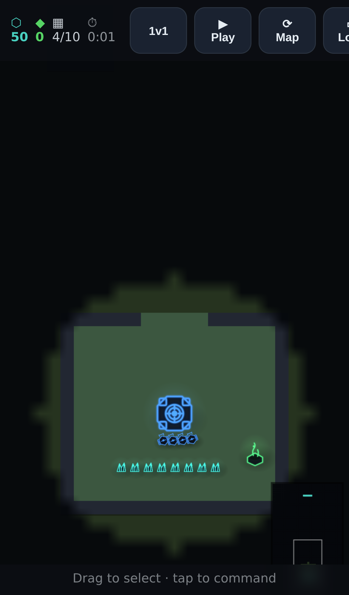
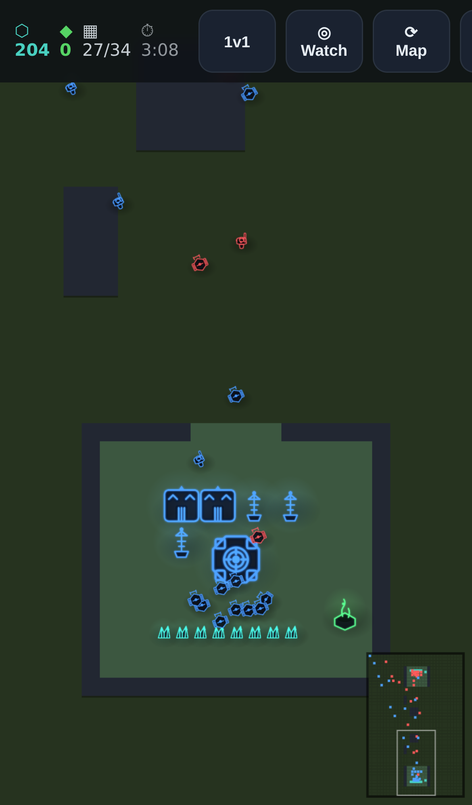
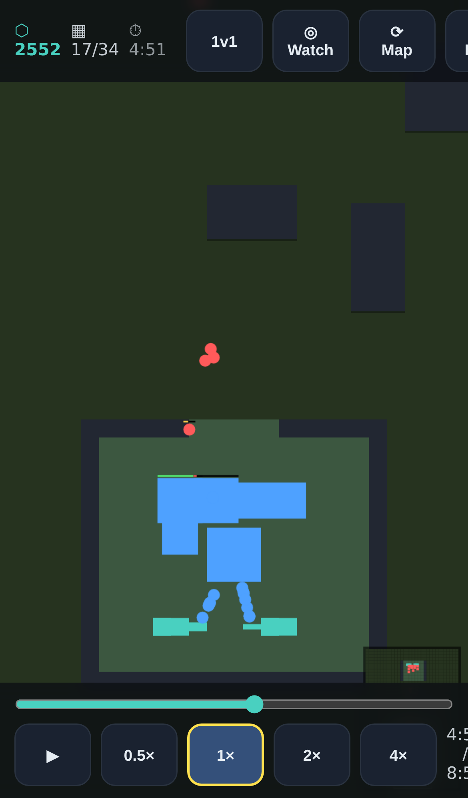

# RTS

A real-time strategy game in the spirit of **StarCraft: Brood War**, **built for mobile**, and
designed from the ground up as a research platform for **superhuman AI** (in the spirit of
AlphaStar). Fully playable in the browser against a computer opponent — with optional computer
teammates and a variety of maps — and architected so the AI can be swapped for human players
over a network without touching the simulation.

It ships as a **static, 100% client-side bundle deployable to GitHub Pages** (no server): the
whole single-player game — simulation, scripted AI, rendering, and eventual neural-net inference
— runs entirely in the browser. Network multiplayer is additive and never required.

> **Status: design phase.** This commit establishes the vision, full game specification, engine
> architecture, mobile-UI design, AI/training plan, and a researched reference library. Code
> implementation begins next, starting with a Terran-only vertical slice.

## Vision & pillars

1. **StarCraft 1 gameplay, faithfully.** Specs start identical to SC:BW — same resources,
   supply, unit/building stats, damage-type-vs-size combat, tech trees. See
   [`docs/specs/sc1-spec.md`](docs/specs/sc1-spec.md).
2. **Mobile-first, rethought.** Not a shrunk PC UI — an interaction model redesigned for a small
   vertical touchscreen (thumb-first controls, selection-then-action, reduced-APM automation),
   verified continuously with Playwright screenshots. See [`docs/specs/ui-mobile.md`](docs/specs/ui-mobile.md).
3. **One deterministic simulation, many consumers.** A single TypeScript core runs in the
   browser, in Node headless training, and in network play — same module everywhere, no
   boundary to drift. Deterministic + fixed-point integers → reproducible replays, lockstep
   netcode, stable RL. See [`docs/specs/architecture.md`](docs/specs/architecture.md).
4. **Players are an interface.** Local human, networked human, scripted bot, and neural-net
   policy are interchangeable behind one `observe → commands` boundary.
5. **Built for superhuman AI on a small budget.** The engine is high-throughput and runs many
   parallel games so we can train AlphaStar-spirit agents on a few GPUs — substituting
   simulation throughput + an imitation warmstart + a self-play league for DeepMind's TPU fleet.
   See [`docs/specs/ai-training.md`](docs/specs/ai-training.md).

## Architecture at a glance

```
          ┌────────────────────────────────────────────────┐
          │            sim core  (TypeScript)              │
          │  deterministic · fixed-point ints · SoA         │
          │  no DOM · no I/O · no float · step(cmds)->state  │
          └──────┬───────────────┬───────────────┬─────────┘
       same module│   same module │   same module │
        ┌─────────▼──┐ ┌──────────▼──┐ ┌──────────▼──────┐
        │  browser   │ │ node        │ │ worker pool     │
        │ WebGL +    │ │ headless    │ │ N parallel      │
        │ mobile UI  │ │ CLI: games/ │ │ games for       │
        │ + input    │ │ self-play / │ │ training data   │
        │            │ │ replays/bench│ │                 │
        └────────────┘ └─────────────┘ └─────────────────┘
```

- **One language:** deterministic, data-oriented TypeScript (typed-array SoA, fixed-point
  integer math, seeded PRNG). The same `sim` module runs in the browser, in Node, and in Web
  Workers — no cross-language boundary.
- **Browser:** WebGL renderer + mobile UI driving the sim directly.
- **Headless/training:** Node CLI + a Worker pool stepping many parallel games.
- **Throughput escape hatch (deferred):** if/when training throughput is the *measured*
  bottleneck, port just the sim hot-loop to Rust→WASM (still serves browser + Node) or a JAX
  vectorized sim — validated bit-for-bit against the TS sim via recorded replays.
- **Decisions locked:** TypeScript-first; first milestone is a **Terran-only vertical slice**
  (full stack end-to-end), then expand to Protoss/Zerg, more maps, and teammates.

## Repository layout (planned)

```
packages/                  # npm workspace (one language: TypeScript)
  sim/         deterministic core (no DOM, no I/O, no float in hot path)
  ai/          scripted controllers; later the policy controller
  render/      WebGL/Canvas read-only renderer
  ui/          mobile UI components, gesture/touch -> commands
  app/         browser game (esbuild) — the thing we screenshot
  headless/    Node CLI: games, self-play, replays, benchmarks, worker pool
maps/          map definitions (data)
replays/       recorded command-stream replays
docs/          specs, research notes, papers, tooling (see below)
```

## Documentation

| Doc | What's in it |
|---|---|
| [`docs/specs/architecture.md`](docs/specs/architecture.md) | Engine design: determinism, ECS/SoA core, tick pipeline, player interface, build targets, repo layout. |
| [`docs/specs/sc1-spec.md`](docs/specs/sc1-spec.md) | The game data: universal mechanics + combat model, and full Terran / Protoss / Zerg unit, building, and tech data. |
| [`docs/specs/ui-mobile.md`](docs/specs/ui-mobile.md) | Mobile-first vertical UI: layout zones, touch grammar (1-finger select / 2-finger pan, smart-tap, command hotbar), control groups, APM-reduction, Playwright workflow. |
| [`docs/specs/maps.md`](docs/specs/maps.md) | Perspective (top-down, north-up), portrait map design (S vs N), elevation in top-down (low/high + ramps), and the map data model. |
| [`docs/specs/ai-training.md`](docs/specs/ai-training.md) | AI plan: scripted bots → behavior-cloning warmstart → PPO → PFSP self-play league → distillation; throughput strategy. |
| [`docs/specs/assets.md`](docs/specs/assets.md) | Art strategy: self-drawn SVG + Kenney CC0 packs (license-clean), rasterized to a GPU texture atlas; per-player team-color tinting. |
| [`docs/research/`](docs/research/) | Synthesized research: [AlphaStar](docs/research/alphastar.md), [efficient RL](docs/research/efficient-rl.md), [SC1 spells & upgrades](docs/research/sc1-spells-upgrades.md). |
| [`docs/papers/index.md`](docs/papers/index.md) | Annotated reading list of 39 reference papers (text committed; PDFs regenerable). |

## Research foundation (the short version)

AlphaStar proved superhuman RTS is possible; its cost was **throughput** (384 TPUs, 44 days),
not algorithmic mystery. Our plan, grounded in the research under `docs/`:

- **Throughput is the lever.** A fast deterministic batched simulator is the asset that lets a
  small team substitute frames-per-second for a TPU fleet (existence proof: **Gym-µRTS** beat
  every prior competition bot in ~60h on a single GPU).
- **Stay model-free** (PPO/APPO) — we own perfect cheap dynamics, so a learned world model
  mostly adds bias; we borrow model-based *tricks* (network scaling, high replay ratio, resets).
- **Warmstart by behavior-cloning our own scripted bots** — the highest-leverage single step,
  no human replay data required.
- **Get action/observation design right** — spatial feature maps, factored (GridNet /
  autoregressive) action heads, and **invalid-action masking** (non-negotiable).
- **Reach superhuman via a PFSP self-play league + a couple of exploiters**, then **distill**
  into one shippable agent.

## Toolchain (deliberately minimal — 2026)

The whole engine + training side has **no build step**: Node 24+ runs TypeScript directly via
native type stripping. Only the browser app carries a tiny esbuild script (for TSX). Details in
[`docs/specs/architecture.md`](docs/specs/architecture.md#build--runtime-toolchain-deliberately-minimal-2026).

| Concern | Choice |
|---|---|
| Package manager | **npm workspaces** |
| Sim / AI / headless / tests | **No build** — run `.ts` directly on Node 24+; tests via `node --test` |
| Type-check | `tsc --noEmit` (→ `tsgo`/TS7 as it stabilizes) |
| Browser bundle | thin in-house **esbuild** script (no Vite/framework) |
| UI runtime | **Preact + @preact/signals** (HUD chrome only; game world is imperative WebGL) |
| Screenshots | Playwright |

```bash
npm install            # workspaces + typescript + @types/node
npm test               # node --test (runs the .ts tests directly, no build)
npm run typecheck      # tsc --noEmit
npm run demo           # headless 2-player economy game + throughput benchmark
```

```bash
# Download + extract reference papers (PDFs are git-ignored; text is committed)
pip install pymupdf
python3 docs/scripts/fetch_papers.py
```

### Current status — playable

A complete vertical slice is playable in the browser: **play vs the AI or watch AI vs AI**, on
procedural maps, with economy, construction, combat, fog of war, pathfinding, and win/lose.

- **`packages/sim`** — deterministic, data-oriented core: fixed-point math, seeded PRNG, SoA
  entity store, tick pipeline (census → commands → construction → production → harvest → combat
  → movement → collision → vision → victory), **flow-field group pathfinding** (one shared
  integer Dijkstra field per goal, so N units to one destination cost one field, not N A\* runs)
  that **routes around building footprints** (dynamic per-State solidity, field cache invalidated
  on building change), **ground-unit collision** (units form a body instead of stacking; workers
  and air units exempt), a **typed-array spatial grid** (target acquisition is O(n·k_local), not
  O(n²)), **SC1/SC2-style mineral saturation** (a patch is reserved while mined, ≈3 workers rotate
  per patch — derived from round-trip timing — with auto re-routing on depletion), **gas via
  refineries** built on vespene geysers, per-structure **rally points** (CCs default to the
  mineral line), the SC1 damage model, and procedural symmetric NvN maps (base plateaus, ramps,
  validated connectivity). **Fog of war** is computed sim-side and exposed through a fog-limited
  `observe(player)` (the fair-play view for network/RL, vs. `fullState()`'s god view; opt-in so
  headless throughput skips it). **Replays** are first-class: opt-in command-stream recording,
  `play`/`replayHashes` re-simulation, and `serialize()`/`deserialize()` of full state to a flat
  `ArrayBuffer` (disk/Worker transfer; the same record is the netcode + RL-trajectory format).
  Systems are **role/capability-driven, not race-specific** (Worker / ResourceDepot / Resource /
  Producer flags in data) so adding a unit — or a race — is data, not new system code.
- **`packages/ai`** — a faction-driven scripted AI (economy, supply, tech, army, attack/defend),
  deterministic and god-vision; the built-in opponent and future BC demonstrator.
- **`packages/app`** — top-down **WebGL2 instanced-sprite renderer** (imperative, never via the
  VDOM): one batched draw for all units/buildings/HP-bars/selection, self-drawn team-colored SVG
  sprites baked to a runtime texture atlas, soft texture-based fog, with a Canvas2D fallback +
  2D overlay for chrome — see [`docs/specs/assets.md`](docs/specs/assets.md). Plus a Preact/signals
  HUD; touch model (1-finger select/box, 2-finger pan, pinch zoom, smart-tap, command hotbar);
  fog, minimap, win screen, and an **in-app replay viewer** (scrubber, play/pause, 0.5–4× speed,
  save/load JSON). One ~40-line esbuild build; static, GitHub-Pages-ready.

- **`packages/app`** also: a **deselect** button, **double-tap to select all of a type on
  screen**, **minimap drag-to-pan**, **Set Rally** / **Build Gas** commands, and a gas readout.
  Desktop controls use left-click selection, right-click smart commands, `A` plus left-click
  attack mode, Patrol, Hold Position, Shift-queued travel, remappable hotkeys, edge pan, scroll zoom,
  middle-click pan, hotgroups, and visible queued waypoints. Mobile controls keep single-tap
  selection/command-card grammar, with a compact **Queue** toggle that appends validated
  move/follow and attack-move point travel through the same sim command path as desktop Shift.

Verified by `node --test` (33 tests: fixed-point, RNG, economy, combat, **replay-hash &
snapshot/restore & byte-serialize determinism**, **group pathfinding (arrives + fans out,
deterministic)**, **mineral reservation/rotation, spread & depletion re-route**, **gas via a
refinery**, **what-if branching**, procedural connectivity, full **AI-vs-AI games end
deterministically**, and an entity-column coverage guard) and Playwright screenshots at phone
resolution.

| Play (fog + base) | AI vs AI battle | Replay viewer |
|---|---|---|
|  |  |  |

Run it: `npm install && npm start` to build/watch the app and serve `packages/app/dist/` via
esbuild's local server. For a static bundle, run `npm run build:app`. Headless throughput
(single-threaded V8, one game, fog off): **~95k ticks/s**
for a 2-player economy and **~8k ticks/s** for a full AI-vs-AI 1v1 (the spatial grid keeps combat
acquisition O(n·k), and building-aware pathing + collision add a per-tick cost that scales with
unit count). Fog of war is opt-in, so training that doesn't need it keeps the fast path. A
Worker/process pool multiplies this across cores — the runway for AlphaStar-style training next.

## Roadmap

1. **Foundations (this commit):** vision, specs, architecture, UI design, AI plan, research. ✅
2. **Terran vertical slice:** TypeScript sim core (economy, a few buildings/units, combat, fog,
   one map, win condition) + mobile UI in the browser + a scripted opponent — **deployed to
   GitHub Pages** so the static, standalone path is validated from the first playable build.
3. **AI loop:** Gym-like env interface + Worker-pool parallelism, scripted bot ladder,
   behavior-cloning warmstart, PPO fine-tune.
4. **Superhuman:** self-play + PFSP league + PBT; distill; APM/reaction constraints; human eval.
   (Port the sim hot-loop to Rust→WASM / JAX here *if* measured throughput demands it.)
5. **Expand:** full Terran roster → Protoss & Zerg, more maps, computer teammates, network play.
